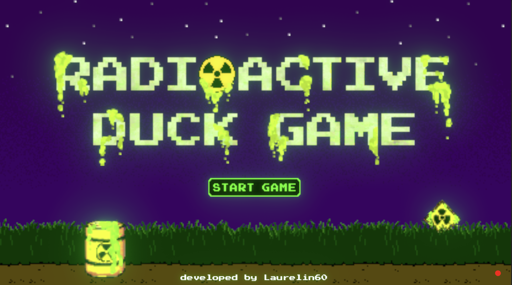
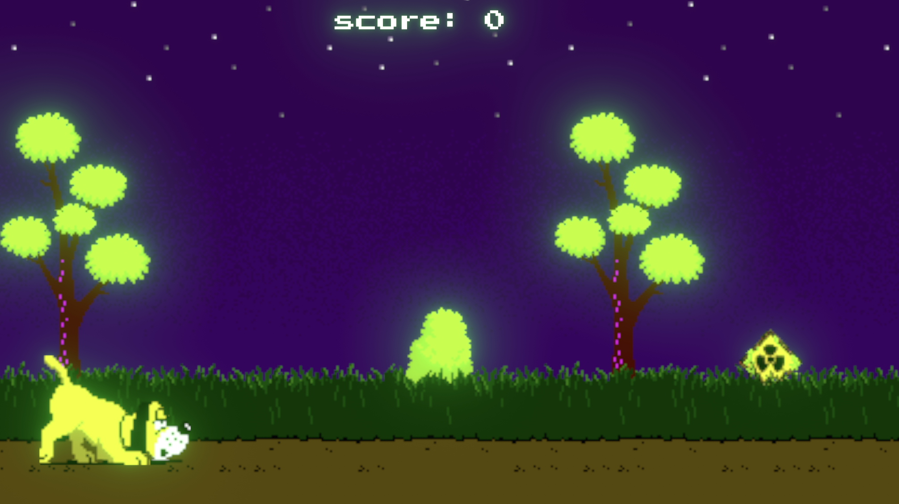
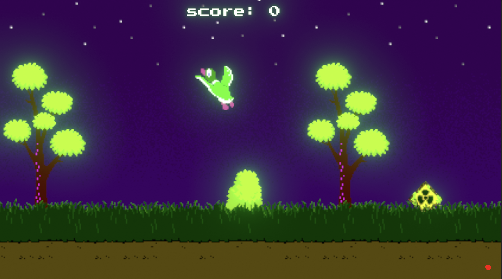
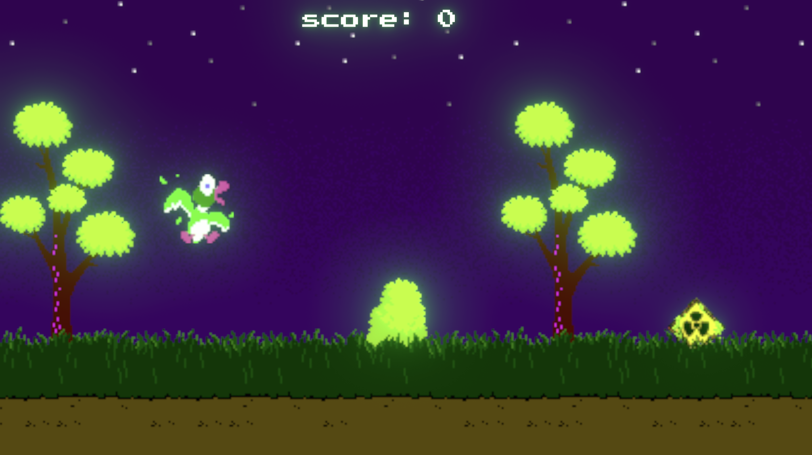
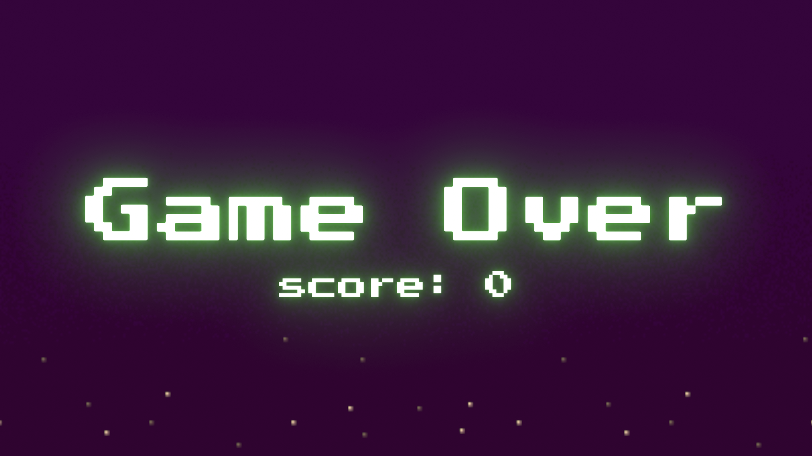

# Radioactive Duck Game ☢🦆 ️

  

> ##  Learning ASL through Computer Vision

## About  

We decided to take a crack at making a Unity game that is both fun and useful! Our game takes in webcam footage and feeds it through a computer vision model to help anyone learn ASL (this repo is the Unity part only).

## Screenshots  

**Start of game:**
  

**Duck Flying:**
  

**Duck Hit**

**Game Over**
